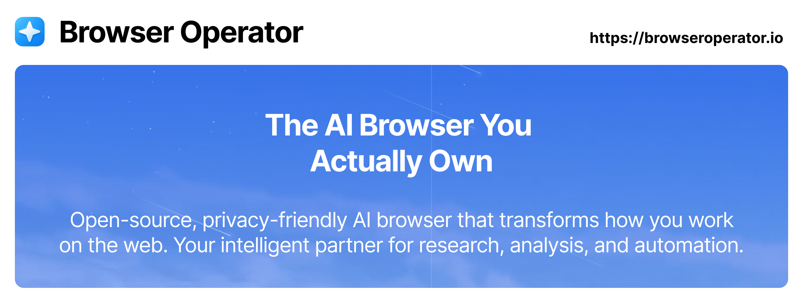

**Open-source, privacy-focused AI browser that transforms how you work on the web. An intelligent platform for research, analysis, and automation—running locally in your browser.**

[Download](https://github.com/BrowserOperator/browser-operator-core/releases) • [Docs](https://docs.browseroperator.io) • [Community](https://discord.gg/fp7ryHYBSY)

---

## 🚀 Getting Started

**[⬇️ Download for macOS](https://github.com/BrowserOperator/browser-operator-core/releases)** | **[⬇️ Download for Windows](https://github.com/BrowserOperator/browser-operator-core/releases)**

**System Requirements:** macOS 10.15+ or Windows 10 (64-bit)+ • 8GB RAM (16GB recommended) • 2GB free disk space

### AI Provider Setup

| Provider | Best For | Setup |
|----------|----------|-------|
| **[OpenRouter](https://openrouter.ai)** | Beginners, 400+ models (Claude, GPT, Gemini, Llama) | Sign in through browser |
| **[OpenAI](https://platform.openai.com)** | GPT models | API key required |
| **[Groq](https://console.groq.com)** | Ultra-fast inference | API key required |
| **[LiteLLM](https://docs.litellm.ai)** | Local models, privacy, advanced users | Proxy + Ollama setup |

**Quick Setup:** Settings → Select provider → Enter credentials → Choose model → Save

---

## 🎬 What You Can Do

**Multi-Agent Automation** – Specialized AI agents work together to handle complex web tasks autonomously

**Privacy-First** – All processing happens locally on your machine. Use local models with Ollama for complete offline operation

**Extensible** – Compatible with 100+ AI models through OpenAI, Claude, Gemini, Llama, and more via LiteLLM

### Use Cases

**Research & Analysis** – Literature reviews, data collection, competitive intelligence, market research

https://github.com/user-attachments/assets/225319db-c5a0-4834-9f37-5787fb646d16

**Shopping & Price Tracking** – Product comparisons, review analysis, price monitoring

https://github.com/user-attachments/assets/c478b18e-0342-400d-98ab-222c93eecd7a

**Business Automation** – Talent sourcing, lead generation, compliance audits

https://github.com/user-attachments/assets/90150f0e-e8c8-4b53-b6a6-c739f143f4a0

---

## 👥 Community & Contributing

**Get Help**
- 📖 [Documentation](https://docs.browseroperator.io) – Comprehensive guides and API references
- 💬 [Discord](https://discord.gg/fp7ryHYBSY) – Join our community for support and discussions
- 🐛 [GitHub Issues](https://github.com/BrowserOperator/browser-operator-core/issues) – Report bugs or request features

**Contribute**
- Submit pull requests, report bugs, improve docs, or share ideas
- See [Contributing Guide](CONTRIBUTING.md) and [build instructions](https://docs.browseroperator.io) in our docs

---

## 📄 License

Browser Operator is released under the [BSD-3-Clause License](LICENSE).

---

**⭐ Star this repository to support open-source AI browser development**

[browseroperator.io](https://browseroperator.io)

